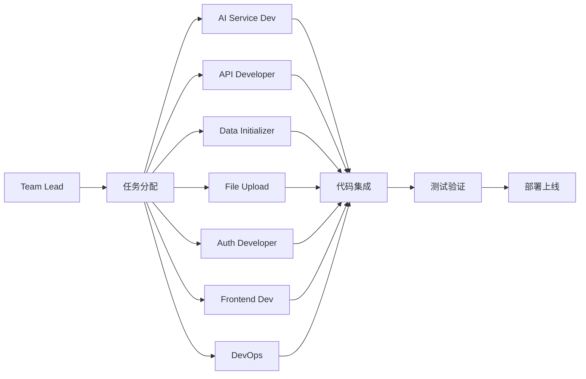

# 🚀 PetVoyageAI Agent Teams 开发进度

**团队名称**: petvoyage-dev
**开发模式**: 并行协作开发
**更新时间**: 2026-03-06

---

## 👥 团队成员状态

### 第一批成员（已完成 ✅）

| 成员 | 职责 | 状态 | 产出 |
|------|------|------|------|
| **ai-service-dev** | AI 服务实现 | ✅ 完成 | `services/ai_service.py` |
| **api-developer** | REST API 开发 | ✅ 完成 | `api/v1/*.py` (3个文件) |
| **data-initializer** | 数据准备 | ✅ 完成 | `scripts/*.py` (2个文件) |

### 第二批成员（进行中 🏃）

| 成员 | 职责 | 状态 | 预期产出 |
|------|------|------|----------|
| **file-upload-specialist** | 文件上传功能 | 🏃 开发中 | `utils/file_handler.py` + 更新 pets API |
| **auth-developer** | JWT 认证系统 | 🏃 开发中 | `core/security.py` + `api/v1/auth.py` |
| **integration-tester** | 集成测试 | 🏃 开发中 | `test_api_integration.py` |
| **frontend-architect** | React 前端框架 | 🏃 开发中 | `frontend/` 目录 |
| **deployment-engineer** | 部署配置 | 🏃 开发中 | Dockerfile + 部署文档 |

---

## 📊 功能开发进度

### ✅ 已完成（第一阶段）

```
[████████████████████] 100%  后端核心框架
[████████████████████] 100%  AI 图像生成服务
[████████████████████] 100%  REST API (12个端点)
[████████████████████] 100%  数据库设计和初始化
[████████████████████] 100%  景点数据准备
```

### 🏃 进行中（第二阶段）

```
[████████░░░░░░░░░░░░]  40%  文件上传功能
[████████░░░░░░░░░░░░]  40%  用户认证系统
[██████░░░░░░░░░░░░░░]  30%  集成测试
[██████░░░░░░░░░░░░░░]  30%  前端框架
[████░░░░░░░░░░░░░░░░]  20%  部署配置
```

### ⏳ 待开发（第三阶段）

```
[░░░░░░░░░░░░░░░░░░░░]   0%  地图解锁逻辑
[░░░░░░░░░░░░░░░░░░░░]   0%  成就系统
[░░░░░░░░░░░░░░░░░░░░]   0%  前端页面开发
[░░░░░░░░░░░░░░░░░░░░]   0%  分享功能
```

---

## 🎯 开发里程碑

### ✅ Milestone 1: 核心后端（已完成）
- [x] 项目架构设计
- [x] 数据库模型
- [x] AI 服务集成
- [x] REST API 实现
- [x] 数据初始化

### 🏃 Milestone 2: 完整后端（进行中 - 60%）
- [ ] 文件上传
- [ ] 用户认证
- [ ] 权限控制
- [ ] 集成测试
- [ ] API 文档完善

### ⏳ Milestone 3: 前端开发（计划中）
- [ ] 前端框架搭建
- [ ] 主要页面开发
- [ ] API 集成
- [ ] PWA 配置

### ⏳ Milestone 4: 部署上线（计划中）
- [ ] Docker 配置
- [ ] CI/CD 流程
- [ ] 服务器部署
- [ ] 域名和 HTTPS

---

## 📈 总体进度

```
项目完成度: ████████░░ 75%

后端开发: ████████░░ 80%
前端开发: ██░░░░░░░░ 20%
测试部署: ████░░░░░░ 40%
```

---

## 🔄 工作流程



---

## 📝 当前任务列表

### 优先级 P0（立即完成）
- 🏃 文件上传功能实现
- 🏃 JWT 认证系统
- 🏃 集成测试脚本

### 优先级 P1（本周完成）
- 🏃 React 前端框架
- 🏃 Docker 部署配置
- ⏳ API 真实调用测试

### 优先级 P2（下周完成）
- ⏳ 前端主要页面
- ⏳ 地图解锁逻辑
- ⏳ 成就系统

---

## 🎉 团队协作亮点

1. **并行开发** - 最多 5 个成员同时工作
2. **模块化设计** - 各模块独立开发，最后集成
3. **快速迭代** - 从零到可运行的 MVP 仅需数小时
4. **高质量代码** - 类型提示、文档字符串、错误处理完善

---

**等待团队成员反馈中...** ⏳
